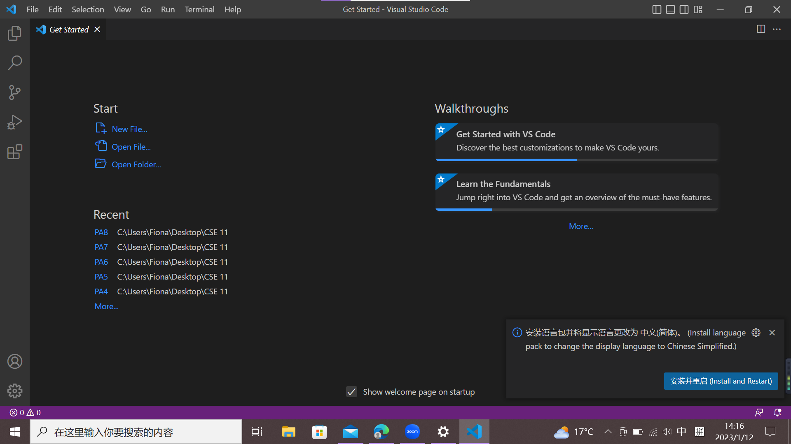
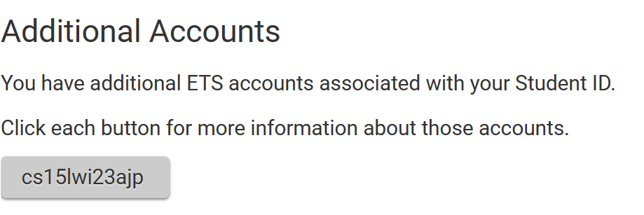
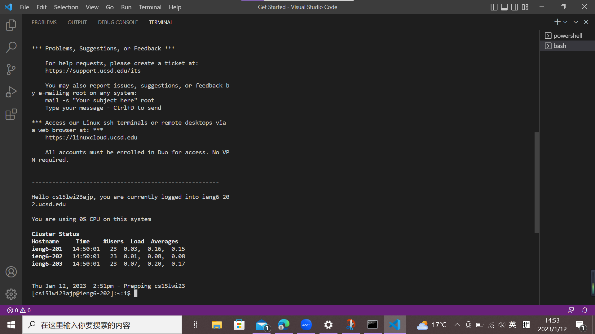
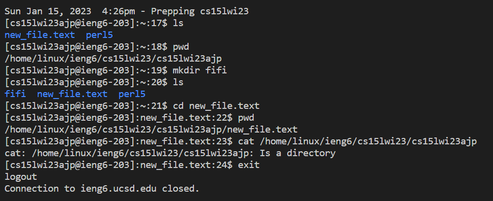
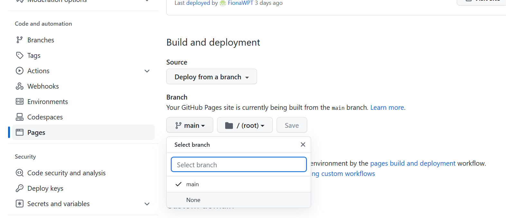
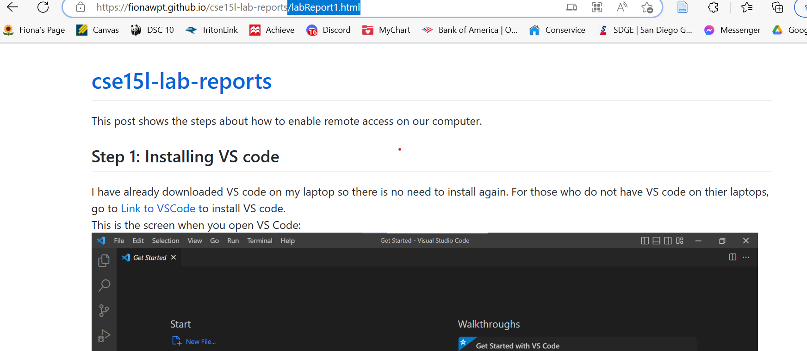

This post shows the steps about how to enable remote access on our computer and how to create a Github page.

## Step 1: Installing VS code
I have already downloaded VS code on my laptop so there is no need to install again. For those who do not have VS code on thier laptops, go to [Link to VSCode](https://code.visualstudio.com/)
to install VS code. 
This is the screen when you open VS Code:

## Step 2: Reset the password of course-specific account 
1. Open the link below: 
[Link to Reset Password](https://sdacs.ucsd.edu/~icc/index.php)
2. Type in your school email without @ucsd.edu and PID. If your email is abc@ucsd.edu, just enter abc.
3. Click in the button under Additional Account

4. Click change your password to reset your password. The current password would be the same as your tritonlink password. 
__important: you would not want your TritonLink password to be changed so choose NO when it is asking you to change MyTritonLini password)__

## Step 3: Remoting Connecting
1. For __Window users__, you need to install GitBash first. 
  Go to this link to install git: https://gitforwindows.org/ 
  For __Mac users__, you do not need to download anything.
2. Open the link and follow the steps to install git bash in VS code: https://stackoverflow.com/a/50527994
3. After setting up git bash in VS code, you can now type in  
   <b>`ssh cs15lwi23abc@ieng6.ucsd.edu</b>  
   (where abc is your account code that is shown in the link where you change your password) 
   Here is the link for you to check your three letters for your account: https://sdacs.ucsd.edu/~icc/index.php
4. The computer would then ask you to make sure you want to continue connecting, type in _yes_.
5. Then you type in your password that you just reset. The screen would show nothing while you typing for security reason.
This is the screen after connecting:

7. Now you are able to try different commands in the terminal!

## Step 4: Trying Some Commands
You can now use any of the commands in the terminal now. Feel free to play around with it.  
Here are some suggestions of the commands you can use: 
`_pwd,mkdir,ls,cd,cat_` 
Some examples would be:  

## Step 5: GitHub Pages
1. Open this link to create a GitHub account: [Link to GitHub](https://www.github.com/)  
2. Create a new repository from the plus sign at the top right corner
3. Name your respository __cse15l-lab-reports__
4. Create a new file in the repository and name the file _sth.md_ (you can decide what sth is)
5. Now you can stat typing in text and using some markdowns ([Link to Markdown]https://commonmark.org/help/)
6. After finish the content, click _commit new file_ 
7. Go to settings on the top bar of the page and click pages on the left side of the menu
8. Select _main_ branch and click _Save_ button

10. Scroll up to the top and click the link of your site
11. Add _your file name.html_ to the end of the website link  

12. Now you are able to visit the site you created!

