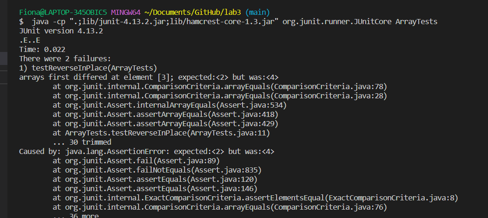
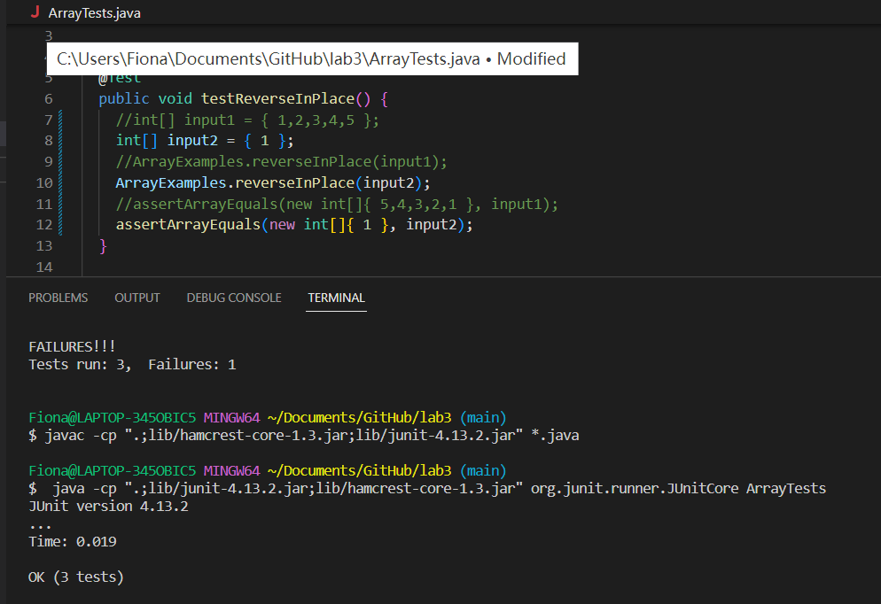

# Part 1:
```js
import java.io.IOException;
import java.net.URI;

class Handler implements URLHandler {
    String result="";
    public String stringSite(URI url) {
        if (url.getPath().contains("/add-message")) {
            String[] output = url.getQuery().split("=");
            result=result+output[1]+"\n";
            return result;
        }
        else{
            return  "404 Not Found!";
        }
    }
}

class StringServer  {
    public static void main(String[] args) throws IOException {
        if(args.length == 0){
            System.out.println("Missing port number! Try any number between 1024 to 49151");
            return;
        }
        int port = Integer.parseInt(args[0]);
        Server.start(port, new Handler());
    }
}
```
# Part 2:
The one of the bugs from lab 3 is from the code of the method _reverseInPlace_ which tries to reverse the order of the arraylist.  A failure-inducing input would be：<br>
`{1,2,3,4,5}`<br>
Howver, an input that doesn’t induce a failure would be:<br>
`{1}`<br>
Below is the screenshots of the symptoms:<br>
__Symptoms for `{1,2,3,4,5}`__<br>
<br>
__Symptoms for `{1}`__<br>


Below is the bug and how we fix it:
## Before:
```js
static void reverseInPlace(int[] arr) {
    for(int i = 0; i < arr.length; i += 1) {
      arr[i] = arr[arr.length - i - 1];
    }
  }
```
## After:
```js
  static void reverseInPlace(int[] arr) {
    int[]newArr = new int[arr.length];
    for(int i = 0; i < arr.length; i += 1) {
      newArr[i] = arr[arr.length - i - 1];
    }
    for(int j=0; j<arr.length;j++){
      arr[j]=newArr[j];
    }
  }
```
## Why the fix addresses the issue
The code is originally written as reversing the array one by one that means the array would change everytime when we do the reverse. For example, `{1,2,3}` would 
become `{3,2,3}`. When we want to change the last number 3 to the origianlly first number 1, the code would use the new array `{3,2,3}` to run the reverse code and so it 
would then result in `{3,2,3}` in the end since it is not using the original array. To fix the bug, we create a new array and put the number in the new array once we finishing reversing and keep the original array the same so that there would not have the issue as before. Then, we use for loop to run through the new array and replace the original array with the reversed (new) array one by one in the same position.

# Part 3
To be honest, everything I've learnt in this past two weeks is new materials to me. I have never tried using code to access a web server and I think it is really cool. By writing different conditions in the code, we are able to make the web shows different output, which is pretty fun. I also learned how to find bugs and to determine failure inducing input and symptoms.
